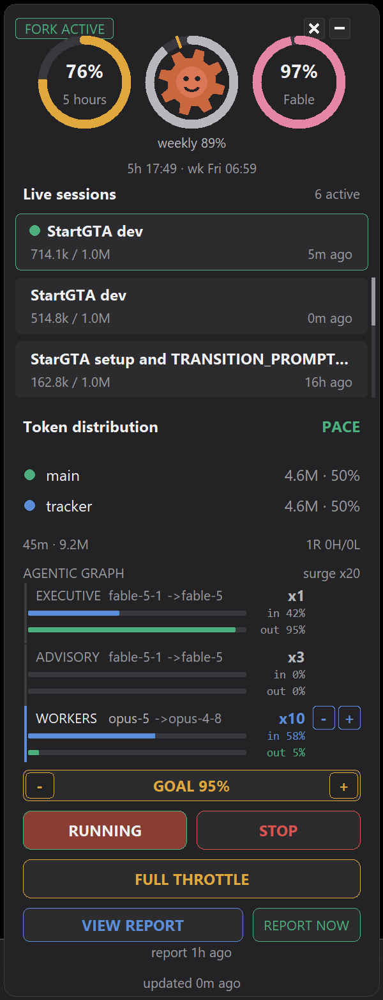

# TokenDistributor

Spend Claude Code's weekly token budget before it resets, without ever starving a live session.

<p align="center"></p>

The overlay: three rings (5-hour, weekly with the gear mascot and an amber goal tick, Fable), live sessions with the main session pinned, token distribution and the current mode, an **AGENTIC GRAPH** ladder chart showing the model each tier is *actually* running on right now over two bars carrying that tier's share of the window's input and output tokens, a `- GOAL 90% +` stepper row, START / STOP, the `AUTO` / `THROTTLE ON` toggle, and VIEW REPORT / REPORT NOW. Each rung carries the count TokenDistributor **allocated** for this poll, with the configured ceiling dimmed beside it (`cfg x3`) whenever they differ, and an `ALLOCATION` line under the ladder naming the rung and the pace reading that put it there.

## What it does

- **Paces usage across sessions.** Every poll it reads the OAuth usage endpoint (5-hour, weekly, and per-model Fable windows), measures how much budget is left against how much time is left, and launches just enough headless `claude -p` work to land near 100% by the weekly reset.
- **Runs five decision modes.** `pace` when behind the curve, `coast` when ahead, `yield` while a foreign interactive session is active, `surge` in the endgame hours before reset, `blocked` when the weekly limit or the 5-hour guard is hit. A running task is never killed by a mode change, only new launches are gated.
- **Treats the weekly goal as a stopping point.** When the weekly window reaches the goal it writes `state/stop.json` once (keys `reason`, `goal`, `weekly`, `at`), the record the main session reads as its stop point, and parks dispatch with reason `weekly_goal`. Falling back under the goal clears the file, and the stop lifts itself at the weekly reset it was written with.
- **Gates dispatch with START / STOP.** The overlay buttons write `state/control.json`; STOP zeroes every launch budget so nothing new starts, while already-running work keeps going and is still reaped.
- **Stops itself, and starts itself again.** Every stop names its reason in `state/control.json` - `operator` (the overlay's buttons, and a stop typed by hand), `fable_bucket` (the allocator's own 97% hard stop, which it now writes rather than leaving to the director), `weekly_goal`, `five_hour`, `snapshot` - together with `until`, the ISO UTC reset of the bucket that caused it. Every poll `control.maybe_resume` lifts a stop whose `until` has passed, or whose bucket has visibly rolled over (utilization more than 5 points under its threshold *and* a reset that has moved forward), writes `auto_resume:<reason>`, clears `state/stop.json` when that record is its own, logs `dispatch resumed: fable reset at Fri 06:59 CT` and re-arms the fork on its normal cooldown. **`operator` never auto-resumes** - and a stop carrying no reason at all reads as `operator`, so nothing hand-written is ever lifted behind the user's back. Nor is one ever restamped into a stop that does: whoever parks dispatch first keeps the reason, so the weekly goal crossing later (the main session and the adopted workers spend that budget too) writes `state/stop.json` and leaves a standing operator STOP exactly as it is. An `until` that is not still in the future is dropped rather than stored, because a reset already behind us would lift the stop on the very next poll. The panel's red band and `tracker.py status` print the same line: `STOPPED: fable bucket 97% - resumes Fri 06:59 CT`, or `STOPPED by operator`. The gated decision carries the reason too, so the "last decision" line under that band reads `Dispatch stopped on the fable bucket (would be surge)` rather than blaming the operator for a bucket's stop.
- **Allocates the budget itself.** `config.json` is the *ceiling*, not the plan. Every poll the allocator measures three buckets - the per-model **Fable** window, the **weekly** window and the **five-hour** guard - takes each one's burn rate **since that window opened** and compares it against the pace that lands on the goal, `required = (goal - utilization) / hours_to_reset`. The comparison happens in rate space on purpose: the endpoint reports utilization in whole percent, so a dead band in utilization space is narrower than the grid the readings land on and every poll reads either "climb" or "give back". The band is `max(|required| x slack, 0.01 / span_hours)` - never narrower than the measurement quantum, and narrowing on its own as the window's baseline lengthens. `expected_at_reset = utilization + rate x hours_to_reset` is still measured and still printed, as the readable summary rather than the decision. The Fable bucket drives a six-rung ladder that protects the executive and gives up the cheapest thing first: advisory count `-1`, then review effort `high -> medium`, then fork cadence `x2`, then the advisory lenses onto the *workers'* model with cadence `x4`, then advisory at its floor with the cadence at its maximum. The executive's model is never one of the rungs, and every rung is checked against the superiority rule before it is applied. The weekly bucket drives the worker lane count between `allocation.min_workers` and the graph's own `surge_count`, chosen so the forecast lands on the goal - which is the automatic surge that replaces reaching for the button when the week is behind. A rung costs **two** consecutive polls ahead of pace to give up and **three** behind to take back, and at most one rung moves per `allocation.min_dwell_seconds` - hysteresis counts polls, not signal, so a rate that stays over the line for ten polls running would otherwise walk the whole ladder in minutes. The lane count is divided by the lanes **actually running**, not by the configured ceiling: the rate was produced by what ran, and attributing it to the ceiling is positive feedback that flips the count between ceiling and floor once per poll. It all lands in `state/allocation.json` (buckets, decision, reasons); `config.json` and `state/graph.json` are never written. `tracker.py alloc` prints the buckets, the pace, the rung and why.
- **Surges on FULL THROTTLE, which is now the manual half.** The button writes `state/throttle.json` and pins the workers to `surge_count`, ignoring the allocator until it is turned off; the loop logs that the override is on and the panel's line turns red. Off, the button reads `AUTO (tap for full throttle)`, because off is not "nothing", it is the allocator running.
- **Keeps the rendered gallery fresh by itself.** Two triggers, evaluated every poll from the allocator's own bucket forecasts. **End of day**: the first poll at or after `snapshot.eod_local` on each *local* day, fired once because `next_eod` in `state/snapshot.json` is advanced past `now` the moment it is read. **Pre-exhaustion**: any bucket forecast to reach its own stop threshold - Fable ≥ 97%, weekly ≥ the goal, five-hour ≥ its guard - within `snapshot.lead_minutes`, or the poll that writes the weekly-goal stop. Either one queues one heavy worker task, `snapshot-<yyyymmddThhmm>`, at priority 200 (above the director fork's 100) on the **workers'** model - never Fable - carrying a fixed brief: wait out every `UnrealEditor*` / `UnrealBuildTool` process without killing one, run `Tools/verify.sh shots`, add the beta frames when `beta-warm.ok` exists, convert to JPEG q86, refresh the README galleries and commit and push by explicit paths. While it is pending or running the director fork is **not** re-armed, so the pass gets the engine and the budget; `snapshot.reserve_fraction` of the weekly bucket is held back from the pacer's target (in the endgame too, where the week-pacing reserve is dropped) so the room exists *before* the goal rather than being begged for after it. `min_gap_minutes` suppresses a trigger that fires inside the shadow of the last run, and consumes the end-of-day slot when it does. `state/snapshot.json` records `{last_run, last_reason, last_commit, next_eod, forecast_trigger_at, commits}`; `status`, `alloc` and the panel print `shots 3h ago - next: eod 23:00 CT / pre-limit in 38 min`, reading `shots queued` or `shots running` while a pass is outstanding rather than claiming a freshness the gallery has not got yet (`last_run` is when the pass was *queued*), and the report's milestone table marks the commits those runs landed.
- **Never loses a task queued from another terminal.** The run loop **supervises** by default (`supervise: true`, `--no-supervise` to opt out): it merges `tasks.json` from disk before every apply, so a row added by a second process survives instead of being overwritten by the loop's own save. That is not hypothetical - on 2026-09-03 21:45 UTC a queued task vanished at the next poll because the loop had been started without it. `tracker.py add` now says which way it will go, reading the loop's heartbeat out of `state/state.json` (`queued: a live loop (last tick 34s ago) picks it up within seconds`, or `queued, but no loop heartbeat ...`), and `tasks.json`'s mtime is part of the loop's wake signal, so the row starts within seconds rather than at the next poll.
- **Renders every time on your clock.** `timezone` (`America/Chicago`) is tried through `zoneinfo` first and falls back to the fixed `tz_offset_hours` when the box has no tz database - which is the case on Windows unless `tzdata` is installed, so the fallback is the live path here and `status` says so outright. Every user-facing time - the panel's `5h 20:19 · wk Mon 06:19 CT` reset line, the bucket table's `resets at`, `fork: started since ...`, the snapshot line, `alloc`, `graph`, `report` and `pricing` - renders local with the zone label. Everything *stored* stays ISO UTC: `state/*.json`, `history.jsonl` and the handover log are compared and replayed, and a local timestamp that jumps an hour twice a year makes all three lie. The one cost of the fixed-offset path is that it does not follow DST, so the offset is edited in November or `tzdata` is installed once.
- **Falls back to a local lane.** While `blocked`, queued tasks are re-dispatched to a local FreeToken engine (Qwen on the 5090) that burns zero cloud budget. A GPU guard refuses to auto-start the engine while a listed process (the Unreal editor, a game) owns the card, since the engine pins about 31.5 GB of it.
- **Runs a configured agentic graph.** `config.json`'s `graph` names the model and headcount at each tier (executive, advisory, workers); the legacy `worker_model` / `max_concurrency` keys are derived from it, the fork brief is handed the same line through its `{graph}` placeholder, and `state/graph.json` (the overlay's `-` / `+`) overrides it without touching the config.
- **Keeps the tiers in capability order, with a fallback under each.** The executive makes the crucial calls and the advisory lenses judge the work, so the graph must read `executive >= advisory >= workers` on `MODEL_RANK` (Fable 5.1 > Fable 5 > Opus 5 > Opus 4.8 > Sonnet 5 > Haiku 4.5 > the local model); a violation is a warning everywhere it is printed, and `tracker.py graph set` refuses to write a **new** one without `--force` (a violation already standing on disk is reprinted, not re-refused, so a later `workers.count=20` still goes through). Each tier also names a `fallback` (Fable 5 for the executive and advisory, Opus 4.8 for the workers): when a launch dies on a 529, an overload, or a rate / session / usage limit, the dispatcher marks `state/limited.json`, requeues that one task with the tier's fallback forced for its next launch, and keeps new launches for that tier on the fallback for `fallback_minutes` before trying the primary again. The requeue is a queue entry, not a launch, so it still passes the tick's concurrency budget, STOP and the fork's re-arm gate. When the **fallback** is the one that dies, the primary's mark is left exactly as it stands and the row stays failed: overwriting it with the fallback's id would send the next launch straight back into the model the account just refused. It never falls back **upward** - a worker never lands on the executive's model - and the row records the model that actually ran (`model_used`) while `model` keeps holding what the row asked for.
- **Reports where the work went.** It parses the session, fork and Workflow-agent transcripts for a window, splits every turn by tier and by what it did (DECIDE / DELEGATE / READ / AUTHOR / OPS), and writes `reports/latest.html`: a page whose verdict says whether the executive tier stayed executive-only (the 60% hands-on rule). It runs itself when a fork finishes a milestone and when dispatch stops, and on demand from the CLI or the overlay's **VIEW REPORT**.
- **Says what each tier actually did, not only what it cost.** A **What each tier did** section sits under the verdict, three blocks side by side: the **executive** one lists the window's commits (in the tracked repo *and* in TokenDistributor itself, by author date), the contract headings those commits added under `dev_JSON/` and `docs/CONTRACTS.md` (`added "## v2.5.3"`), every workflow it dispatched with its agent counts, the hand-over notes written, and the rulings its own transcripts state outright (a whole-word match, so "still undecided" is prose and not a decision); every one of those lists is **ranked before it is capped** - newest commits, newest dispatches, costliest rulings - and the count beside the block says how many there were in full; **advisory** is one line per review lens from that lens's own journal result (`approve=false, 3 serious, 5 minor - <first serious finding>`); **workers** is one line per build lane (`4 files, tests 182/182 passed - <first changed item>`). Every line is *extracted*, never summarised by a model: it costs no tokens, it invents nothing, and a journal it cannot parse is skipped rather than described. Secrets are redacted and an absolute path over 80 characters is shortened to its basename before anything reaches the page. The commit-cost table is ranked by dollars with the top-3 share stated above it (`top 3 commits = 71% of the window's commit cost`), and every time on the page - window, hourly axis, milestone spans, "generated at" - renders in the operator's zone with its label (`CT`) while `summary.json` keeps ISO UTC. Optional and off: `report_summarize` `{enabled, model, max_bullets}` pipes each tier's raw bullets through `claude -p` for a tighter set, falls back to the raw extraction on any failure or 60-second timeout, and starts no process at all while it is disabled.
- **Stamps every row with the role that produced it.** Each session and agent carries a role in `main_session` / `fork_session` / `workflow_agent` and, for a fork, the model it actually ran on, read from the append-only `state/handover.log` (every start and finish the dispatcher writes) and the task rows. Tiers follow that role rather than the model id, which is what keeps the verdict upright in both directions: one model at every tier no longer files each worker lane as executive, and a fork that ran on a model the graph has *since* moved to the worker tier stays executive, flagged **role-tiered** in its row and named in a caveat. The page carries a **Roles** table (role x model: turns, output, weighted cost, dollars) and prints the `graph_in_force` it was generated against in its footer, so a page read next week is not reinterpreted against next week's graph.
- **Prices that work in dollars.** `config.json`'s `pricing` block carries each model's published list price (input / output / cache write 5m / cache write 1h / cache read, USD per 1M tokens) with the source URL and the date it was read, and the report's **What it cost** section bills the window's own usage records at it: total USD, a stacked bar per model of the five components, by tier, by lane role, per hour, and the cost between consecutive commits. A model with no published price is shown as `unpriced` and named in a caveat, never billed at a guessed rate; the local FreeToken lane is priced at 0. `state/pricing.json` (`tracker.py pricing set`) overrides one field at a time without touching the config.
- **Bills both cache-write durations.** `usage.cache_creation` splits every creation figure into 5-minute and 1-hour writes, and the published table charges the 1-hour ones at 2&times; base input against the 5-minute ones' 1.25&times;. So the price table carries both numbers and `cost_usd` has five terms, not four. On this machine's traffic the 1-hour share runs 10-40% of creation per model, which a single-rate formula would quietly understate by about 3.5% of the total and by the same bias in every cut below it.
- **Re-reads `config.json` while it runs.** Every poll stats the file and re-parses it when the mtime or size moved, applying every non-path key onto the live `Config` (state paths never move under a running loop) and logging `config reloaded: <keys>` and `graph changed: <old> -> <new>`. The fork's model and brief are refreshed from the graph in force before every launch, not only on a re-arm, so an executive model edited mid-run reaches the very next fork instead of the next restart - the failure of 2026-09-03 19:48 UTC, when the graph was changed under a running loop, `state/graph.json` carried only the worker count, and the fork launched on the stale in-memory model. The overlay re-reads the same file on every refresh, so an edit shows on the panel within seconds. The one edit that cannot win is a field `state/graph.json` pins: the override wins field by field, so an executive model edited in `config.json` while the override names it is applied to the config and then ignored by every reader. That is named rather than swallowed - startup, `tracker.py graph` and the reload itself print `note: state/graph.json pins executive.model=...; config.json's executive.model is ignored (tracker.py graph set ..., or delete that key from state/graph.json)`, the reload printing only the pins the edit just hit.
- **Draws that graph as a ladder chart, live.** The panel's **AGENTIC GRAPH** block is one rung per tier, executive over advisory over workers, hung off a spine on the left, with the tier, the model and `xN` in aligned columns. The model on each rung is the one **actually in use**, re-derived every refresh: `state/handover.json` for the executive while the fork is running, the running rows' `model_used` for the workers (`+N` when more than one), the configured model - or its fallback while `state/limited.json` names the primary - for the advisory lenses. When it is not what `config.json` asks for, the configured id follows it dimmed as `cfg fable-5-1` and a one-line `active vs configured` note appears under the ladder. Each rung otherwise carries its tier's fallback dimmed after the model (`fable-5-1 ->fable-5`) and a red **LIMITED** tag while that rung's primary is marked limited; the worker rung is the emphasis and its `-` / `+` still write `state/graph.json`. A dimmed dot in front of a model id marks a tier `state/graph.json` pins. Neither dimmed suffix is ever ellipsised - a rung reading `cfg fab...` names no model - so when the tag and the configured id cannot share one rung the model column slides left, then the tag shortens to `LIM`, then to a red dot beside the count, which is what keeps both readable from 100% to 200% DPI.
- **Puts the token shares on the ladder.** Under every rung sit two thin bars: that tier's share of the window's **input** tokens (input + cache creation + cache read) in blue and of its **output** tokens in green, each labelled `in NN%` / `out NN%` in a monospaced right-aligned column, so the six figures compare down the ladder. The numbers come from `state/tiers.json`, which the loop rebuilds every `tiers_refresh_seconds` off the poll thread from the same role-stamped parse the report uses; the overlay only ever reads that file, so a redraw never opens a transcript. Repeat builds are cheap because `state/ledger_cache.json` keys a per-transcript tally on path + mtime + size + window start, and a fork's transcript is only re-read once it has grown. `tracker.py status` prints the same split as one line.
- **Shows an always-on-top overlay.** A Tk card docked near the Sundial widget, refreshed every few seconds, with minimize (collapse to a bar) and close buttons and its own live session, distribution, graph, goal, control, and report rows.

## Setup

Prerequisites:

- Python 3.13 on Windows (the overlay and process control use Windows APIs). No third-party packages, the app is standard library only, so there is nothing to `pip install`.
- Claude Code CLI on `PATH` (`claude`), logged in. The OAuth token in `~/.claude/.credentials.json` is read at runtime and sent only to `api.anthropic.com`.

```powershell
git clone https://github.com/weihaoc168/TokenDistributor
cd TokenDistributor
```

The keys in `config.json` that matter most, with this machine's current values:

| Key | Current value | Meaning |
|---|---|---|
| `graph` | E fable-5.1 x1, A fable-5.1 x3, W opus-5 x10/20, each with a `fallback` | the agentic graph; `worker_model`, `throttle_model`, `max_concurrency` and `surge_concurrency` are derived from it (`state/graph.json` overrides) |
| `fallback_minutes` | `30` | how long `state/limited.json` keeps a tier on its fallback before the primary is tried again |
| `known_models` | six `claude-*` ids | allow-list for graph model and fallback ids; an unknown id warns, it never refuses |
| `pricing` | list prices for the five `claude-*` ids + the local model | USD per 1M tokens per model: `input`, `output`, `cache_write` (5m), `cache_write_1h`, `cache_read`, each row with its `source` and `checked` date (`state/pricing.json` overrides). A model missing here, or missing any one of the five, reports as `unpriced` |
| `pricing_default` | `null` | price for a model the table does not name; null on purpose, so nothing is billed at a stand-in rate |
| `report_repo` | `C:/Users/chenw/StarGTA` | repo watched for the fork-milestone report trigger, and the first of the two repos the report's executive block reads commits from (TokenDistributor itself is the other) |
| `report_summarize` | `{enabled: false, model: claude-haiku-4-5-20251001, max_bullets: 8}` | optional polish of the report's "What each tier did" bullets through `claude -p`. Off by default and off for any malformed value: this is the only path in report generation that spends tokens, so it never turns itself on |
| `tiers_refresh_seconds` | `300` | how often the loop rebuilds `state/tiers.json`, the per-tier token shares the panel's bars read |
| `weekly_goal` | `0.9` | weekly utilization the week stops at (`state/goal.json` overrides) |
| `fable_goal` | `null` | the Fable window's own stopping point; null means "the same as `weekly_goal`" |
| `allocation.ahead_step` | `0.03` | slack above the required pace, as a fraction of it, before a rung is given up (floored at the measurement quantum) |
| `allocation.behind_step` | `0.02` | slack below the required pace, as a fraction of it, before a rung is taken back (same floor) |
| `allocation.min_advisory` | `1` | floor for the advisory count the ladder steps down |
| `allocation.min_workers` | `2` | floor for the worker lanes the weekly bucket steps down |
| `allocation.max_fork_cooldown_seconds` | `1800` | ceiling for the fork re-arm cadence the ladder stretches |
| `allocation.min_dwell_seconds` | `1800` | wall-clock floor between rung moves, whatever the poll counters say |
| `snapshot.enabled` | `true` | the screenshot policy; `false` turns both triggers and the reserve off |
| `snapshot.eod_local` | `"23:00"` | the end-of-day slot, on the **local** clock; fires once per local day |
| `snapshot.lead_minutes` | `45` | how far ahead of a bucket's own stop the pre-exhaustion trigger fires |
| `snapshot.reserve_fraction` | `0.02` | weekly budget held back from the pacer's target for the pass, endgame included |
| `snapshot.repo` | `C:/Users/chenw/StarGTA` | the repo whose gallery is refreshed and committed (falls back to `report_repo`) |
| `snapshot.min_gap_minutes` | `120` | a trigger inside this shadow of the last run is suppressed |
| `timezone` | `America/Chicago` | the operator's zone; tried through `zoneinfo` first |
| `tz_offset_hours` | `-5` | the fallback offset when there is no tz database (this box). Does not follow DST |
| `tz_label` | `""` | the label beside a rendered time; `""` derives it (`CT`) |
| `supervise` | `true` | the run loop merges external `tasks.json` edits before every apply |
| `local_enabled` | `true` | turn on the local FreeToken / Qwen lane |
| `local_model` | `Qwen3.8-27B-NVFP4` | served model name for local dispatch |
| `local_model_path` | `D:\FreeToken Desktop\Qwen3.8-27B-NVFP4` | model path passed to `ft daemon start` |
| `local_ft_bin` | `C:\Users\chenw\AppData\Local\FreeToken\venv\Scripts\ft.exe` | path to the engine's `ft.exe` |
| `local_gpu_guard_procs` | `UnrealEditor.exe`, `UnrealEditor-Cmd.exe`, `RainbowSix.exe` | never auto-start the engine while any of these run |
| `local_prompt_preamble` | standing local-agent instructions | text prepended to every local dispatch |

## Quick start

```powershell
py  -3.13 tracker.py run                 # start the control loop (leave running)
pyw -3.13 tracker.py overlay             # open the always-on-top panel
py  -3.13 tracker.py goal 85             # set the weekly goal (0.85, 85 or 85% all mean 85%)
py  -3.13 tracker.py status              # live rings, pacing, queue, one allocation line
py  -3.13 tracker.py alloc               # the buckets, their pace, the ladder rung and why
py  -3.13 tracker.py graph               # print the tiers, their fallbacks and the order warnings
py  -3.13 tracker.py graph set workers.count=20 workers.fallback=claude-opus-4-8
py  -3.13 tracker.py graph set --force advisory.model=claude-sonnet-5   # only way past the order rule
py  -3.13 tracker.py pricing             # print the per-model list prices the report bills at
py  -3.13 tracker.py pricing set claude-opus-5.output=25 claude-opus-5.checked=2026-09-03
py  -3.13 tracker.py pricing set claude-opus-5.cache_write_1h=10   # 1-hour writes bill at 2x base input
py  -3.13 tracker.py report --open       # build the work-distribution page and open it

# queue real work
py  -3.13 tracker.py add --id my-task --prompt "..." --cwd C:\path\to\project --weight heavy --priority 5
```

- **Stop dispatch:** press **STOP** in the overlay (writes `state/control.json` with reason `operator`); the loop launches nothing new, running work continues. Press **START** to resume - an operator stop is the one kind that waits for a person. `tracker.py dispatch` prints the switch and its reason; `tracker.py dispatch stop --reason fable_bucket` writes a stop that lifts itself at that bucket's next reset, taken from the last poll's `state/allocation.json`; with no fresh reset in that file (the loop is down, or the window has since rolled) it says so and the stop holds until a person lifts it.
- **Close the overlay:** the **X** button, `Esc`, or right-click.

State files under `state/`:

| File | What it holds |
|---|---|
| `control.json` | the dispatch switch: `{dispatch, reason, until, changed_at}` - `running`/`stopped`, why it is parked (`operator`, `fable_bucket`, `weekly_goal`, `five_hour`, `snapshot`, or `auto_resume:<reason>` on the record a resume leaves) and the ISO UTC bucket reset that lifts it (null for `operator`, which only a person lifts) |
| `goal.json` | per-user weekly-goal override the `- / +` steppers write |
| `stop.json` | written once the weekly goal is reached, the main session's stop point |
| `throttle.json` | the FULL THROTTLE flag (`{"active": ...}`), the manual override that pins the workers to `surge_count` and switches the allocator off |
| `allocation.json` | `{buckets, decision, reasons, notes, generated_at}` - every bucket's utilization, burn rate, forecast and pace, the ladder rung the loop is on, and the graph it budgeted out of the ceiling. Written every poll; read by `apply_graph`, the fork's `{graph}` line and the panel, so the allocation is decided in one place and applied everywhere from one file |
| `snapshot.json` | `{last_run, last_reason, last_commit, next_eod, forecast_trigger_at, commits}` - the screenshot policy's record: when the gallery was last refreshed and why, the end-of-day slot still to come, the forecast countdown to the first bucket stop, and the commits those runs landed (which the report's milestone table marks) |
| `graph.json` | per-user agentic-graph override the ladder chart's `-` / `+` writes; a patch, so only the fields set here stop following `config.json` - and those fields are *pinned*: the loop, `tracker.py graph` and the panel's dot say which, because an edit to a pinned field in `config.json` does nothing at all |
| `limited.json` | `{model, since, reason}` for the model a launch last failed on with a 529 or a limit; expires after `fallback_minutes`, and is cleared as soon as that model completes a run |
| `handover.json` | the newest fork handover the parent session watches: task, mode, model, parent session, status, and the finish figures |
| `handover.log` | append-only, one JSON object per line: every `started` / `done` / `failed` handover record ever written. The ledger reads it for the model each fork actually ran on |
| `tiers.json` | `{window, tiers: {executive/advisory/workers: {input, output, sessions}}, generated_at}` - the token shares the ladder's bars draw, rebuilt by the loop every `tiers_refresh_seconds` |
| `ledger_cache.json` | per-transcript tallies keyed on path + mtime + size + window start, with the message ids each one counted, so an unchanged transcript is never parsed twice |
| `pricing.json` | per-user price override `tracker.py pricing set` writes; a patch, so only the fields set here stop following `config.json` |
| `report.json` | the last work-distribution report: path, reason, window |
| `overlay.json` | the overlay's collapsed / expanded state |
| `history.jsonl` | the log of usage snapshots the pacer reads back |

Reports land in `reports/`: `<UTC timestamp>-ledger.html`, the `<timestamp>-summary.json` it was built from, and `latest.html` (a copy of the newest, the one **VIEW REPORT** opens).

## Tests

```powershell
py -3.13 tests/test_all.py               # 189/189
```

## Acknowledgements

Built with Claude Code, using Claude models as the workers it dispatches and the reviewers of its own code. The local fallback lane runs on a FreeToken engine serving a Qwen model. The overlay is plain Tk from the Python standard library, and it is designed to sit beneath Sundial, the desktop widget that first made Claude Code usage visible at a glance.

Unofficial project, not affiliated with Anthropic. The usage endpoint is undocumented and may change at any time.
</content>
